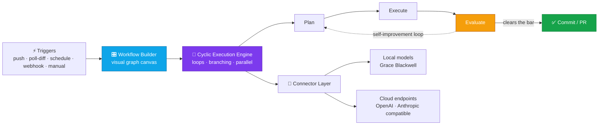

# Davis Sneed

### AI &amp; Full-Stack Engineer · Agentic Systems

**Seattle, WA**

 

---

## 👋 About

**AI and software engineer with 2+ years of professional experience** building agentic systems, full-stack applications, and AI infrastructure.

I work across the whole stack — React/Next.js front ends, Python services behind them, and the LLM orchestration, data pipelines, and evaluation in between. I currently work in **data operations for Amazon Personal Robotics**, running QA and validation on the operational data that feeds machine learning pipelines. Outside of that I co-founded **AWO** (*Agentic Workflow Orchestrator*) — a visual agent workflow builder with self-improving cyclic execution graphs and always-on polling agents.

<table>
<tr>
<td width="50%" valign="top">

**🤖 Agentic AI**
Cyclic workflow graphs · self-improvement loops · autopilot agents · tool use · model routing · token optimization

**🧱 Full-Stack**
React · Next.js · FastAPI · Django · Flask · PostgreSQL · Redis

</td>
<td width="50%" valign="top">

**🦾 Robotics & ML Data**
Robotics QA · AR/VR data collection · validation and labeling at scale

**🔐 Security-Minded**
Cyber Security concentration · cryptography · network analysis · secure by default

</td>
</tr>
</table>

---

## 🚀 AWO — Agentic Workflow Orchestrator · *Co-founder*
🔒 Private repository — walkthrough and demo available on request

> **AWO** is a visual builder and runtime for **self-improving agent workflows**. You compose agents on a graph canvas and AWO executes the graph — **cyclic graphs**, not just DAGs, so a workflow can loop back on itself, evaluate its own output, and re-run until the result clears the bar. Branching, parallel fan-out, long-lived **polling agents** that watch the outside world, and an **autopilot mode** where agents plan, execute, critique, and commit multi-step software tasks with no human in the loop.

### What it actually does

<b>📡 Polling agents</b> — agents that watch instead of wait

 

Most agent frameworks only run when you push a button. AWO's polling agents are **long-lived workers on a schedule** — they wake on an interval, look at a source, diff it against the last state they saw, and only spend tokens when something actually changed.

- **Poll-diff triggers** — an agent watches a repo, branch, endpoint, feed, table, or file and fires the workflow only on a real delta, so idle cycles cost nothing
- **Interval + cron scheduling** — per-agent cadence, from seconds-level polling to nightly sweeps, backed by a Redis-driven queue with **backoff on quiet sources** and jitter so pollers don't stampede
- **Cursor / watermark state in Postgres** — each poller remembers where it left off, so restarts resume instead of replaying, and the same change never triggers twice
- **Debounce and coalesce** — a burst of ten commits in a minute becomes one run against the final state, not ten competing runs
- **Fan-out on wake** — one poller can hand its delta to many downstream agents in parallel (review, test, doc, notify) as a single run

<b>🔁 Cyclic execution engine</b> — loops are first-class

 

- **Real cycles, not retries bolted on** — an edge can point backwards; the engine tracks visit counts, iteration budgets, and convergence conditions per loop
- **Plan → Execute → Evaluate → (loop or commit)** — the evaluator node scores its own output against the workflow's bar and decides whether to ship or send it back around with the critique attached
- **Guardrails** — max-iteration caps, wall-clock and token budgets, and stall detection so a workflow that stops improving exits instead of spinning
- **Conditional branching** — route on evaluator scores, tool results, or arbitrary predicates over run state
- **Parallel execution** — independent branches run concurrently and rejoin at a barrier node, with per-branch failure isolation

<b>🤖 Autopilot</b> — multi-step software work, no human in the loop

 

- Takes a task, **plans** the change set, **executes** against a real repo in an isolated workspace, **critiques** the diff, and iterates until it passes
- Runs tests and linters as evaluation signal — the loop is gated on real feedback, not the model's self-report
- Ends at a **commit or PR** with the run's reasoning trail attached

<b>🎛️ Visual workflow builder</b> — compose instead of hand-wiring

 

- **React Flow canvas** — drag agents, tools, evaluators, branches, and loop-backs onto a graph instead of writing orchestration glue
- **Typed ports and state passing** — outputs flow along edges as structured artifacts, so downstream agents get data rather than re-parsed prose
- **Live run view** — watch nodes light up as they execute, with per-node inputs, outputs, token spend, and latency
- **Run history and replay** — every execution is persisted, inspectable, and re-runnable from any node

<b>🔌 Connector layer & model routing</b> — model-agnostic by design

 

- **Local-first inference** on Grace Blackwell hardware, or any **OpenAI/Anthropic-compatible** endpoint — swappable per node
- **Per-node model routing** — cheap fast models for classification and polling triage, frontier models for planning and critique
- **Token optimization** — context trimming, artifact reuse across loop iterations, and caching so a self-improving cycle doesn't re-pay for the same context every pass
- **Tool use** — shell, HTTP, filesystem, and database tools exposed to agents with per-node scoping

<table>
<tr><td width="33%" valign="top">

**📡 Polling agents**
Long-lived watchers that wake on a schedule, diff against last-seen state, and only fire on real change.

</td><td width="33%" valign="top">

**🔁 Self-improvement loops**
Agents evaluate their own output and iterate — cycles are first-class, not an escape hatch.

</td><td width="33%" valign="top">

**🔌 Model-agnostic**
Local inference on Grace Blackwell or any OpenAI/Anthropic-compatible endpoint, routed per node.

</td></tr>
</table>

---

## 💼 Experience

<b>Quality Assurance Technician, Data Operations</b> — Amazon Personal Robotics <i>(via Apex Systems)</i> · <code>06/2026 – Present</code>

 

- Run structured QA testing on robotics systems, documenting performance metrics affecting accuracy, reliability, and usability
- Analyze, validate, and label operational data feeding ML pipelines — surfacing patterns and inconsistencies that improve training data quality
- Partner with engineering and operations teams to execute data collection protocols and support system validation
- Use Python scripting to support hardware-in-the-loop testing and data capture

<b>Graduate Engineer / Site Lead</b> — Qualitest · Kirkland, WA · <code>02/2026 – 06/2026</code>

 

- **Site Lead** over a team of 5 data collectors across multiple locations, owning timelines, quality standards, and research protocol adherence
- Supported ML development for **humanoid robotics** programs, capturing and managing training data with AR/VR technology
- Maintained a **95%+ data pass rate** through rigorous QA review and data validation
- Resolved data inconsistencies with cross-functional research, engineering, and operations teams

<b>Software Engineer</b> — PIVOT · <code>09/2025 – 01/2026</code>

 

- Created high-fidelity UI designs in Figma and shipped responsive features in JavaScript, HTML, and CSS
- Integrated front-end components with a **Python/Django + PostgreSQL** backend, writing SQL to power dynamic data rendering

🏆 <b>Scrum Master & Full-Stack Developer</b> — R7D LLC <i>(SpaceX vendor)</i> · <code>09/2024 – 05/2025</code>

 

- Led a year-long capstone as **Scrum Master**, coordinating a team of 4 with Git, GitHub Projects, and Agile workflows
- Built a timeline visualization web app in **React, Next.js, Python, and PostgreSQL** — drag-and-drop interactions, dynamic visualizations, and SQL-backed models for real-time event correlation
- 🏆 Awarded **Best Senior Design Computer Science Project**, Gonzaga School of Engineering & Applied Sciences, 2025

---

## 🛠️ Featured Projects

| Project | What it is | Stack |
|:---|:---|:---|
| 🤖 **[TARS](https://github.com/dsneed123/TARS)** | Autonomous coding agent — *Task Automation & Repository Steward*. Plans, writes, and ships code end to end against real repos. | `Python` `Claude API` |
| 🐘 **[elephant-dashboard](https://github.com/dsneed123/elephant-dashboard)** | Real-time trading dashboard — stocks, crypto, and Kalshi signals with live charts, targets, and stop-losses. | `TypeScript` `Python` |
| 🏃 **[athlete-vision](https://github.com/dsneed123/athlete-vision)** | 40-yard-dash biomechanical analysis: pose estimation, stride metrics, movement-optimization datasets. | `Python` `CV/ML` |
| 🌐 **[packet-mapper](https://github.com/dsneed123/packet-mapper)** | Web-based packet sniffer that maps live network connections onto a world map. | `Python` `networking` |

<b>📂 More public projects</b> — security tooling, ML, and product builds

 

| Project | What it is | Stack |
|:---|:---|:---|
| **[InvisiMark](https://github.com/dsneed123/InvisiMark)** | Invisible watermarking service binding ownership metadata to images to trace unauthorized sharing. | `Python` `cryptography` |
| **[shamir_secret_sharing](https://github.com/dsneed123/shamir_secret_sharing)** | Threshold cryptography — split a secret into shares that require a quorum to reconstruct. | `Python` `cryptography` |
| **[intrigue](https://github.com/dsneed123/intrigue-)** | PyTorch model trained on public social data to predict view/like counts and rate content virality. | `PyTorch` |
| **[resume-optimizer](https://github.com/dsneed123/resume-optimizer)** | Single-page resume builder with ATS optimization, import/export, and fine-grained typography control. | `Python` |
| **[elephant](https://github.com/dsneed123/elephant)** | Kalshi prediction-market copy-trading platform — track top bettors, analyze performance, mirror trades. | `Python` |
| **[bucket-budget](https://github.com/dsneed123/bucket-budget)** | Personal finance manager — bucket budgeting, purchase ranking, savings goals, spending insights. | `Python` |

<b>🔒 Private work</b> — available to walk through on request

 

| Project | What it is | Stack |
|:---|:---|:---|
| **AWO** | *Agentic Workflow Orchestrator* — polling agents, self-improving cyclic execution graphs, and autopilot *(see above)*. | `FastAPI` `Postgres` `Redis` `React Flow` |
| **stock-signal-scanner** | Self-hosted scanner: ingests financial news, runs a local LLM analysis engine, surfaces per-ticker signal cards. | `Go` `Python` `Docker` |
| **TARS-Lite** | TARS running fully local on Ollama — no cloud, no API keys. | `Python` `Ollama` |
| **crypto-trading-bot** | Autonomous crypto trading bot with a GUI dashboard and no external API-key dependency. | `Python` `Docker` |

---

## ⚙️ Tech

**Languages**

**Frameworks & Data**

**AI & Infrastructure**

 

---

## 📊 GitHub

<picture>
  <source media="(prefers-color-scheme: dark)" srcset="https://github-profile-summary-cards.vercel.app/api/cards/profile-details?username=dsneed123&theme=github_dark">
  
</picture>

<picture>
  <source media="(prefers-color-scheme: dark)" srcset="https://github-profile-summary-cards.vercel.app/api/cards/repos-per-language?username=dsneed123&theme=github_dark">
  
</picture>
<picture>
  <source media="(prefers-color-scheme: dark)" srcset="https://github-profile-summary-cards.vercel.app/api/cards/most-commit-language?username=dsneed123&theme=github_dark">
  
</picture>

### 📈 Contributions per year

Averaged across 2022–2026 · 2026 is year to date, running at roughly <b>4,800/yr</b>

---

## 🎓 Education

**B.A. Computer Science & Computational Thinking** — Gonzaga University, Spokane, WA · *May 2025*
Concentrations in **Cyber Security**, **Software Development**, and **Philosophy**

🏆 Winner — School of Engineering & Applied Sciences **2025 Best Senior Design Computer Science Project** *(timeline visualization capstone with R7D LLC)*

---

## 📬 Currently

- 🔭 Building **AWO** — polling agents and self-improving agent workflows with real autopilot — and **TARS**, an agent that takes a task and ships the PR
- 🌱 Going deeper on agent evaluation, model routing, and local-first inference
- 💬 Ask me about agentic workflows, LLM tool use, ML data pipelines, or application security
- ⚡ Fun fact: most of my side projects were built *by* agents I wrote

 

### Let's build something.

Built by an engineer who ships — and by the agents he builds.

